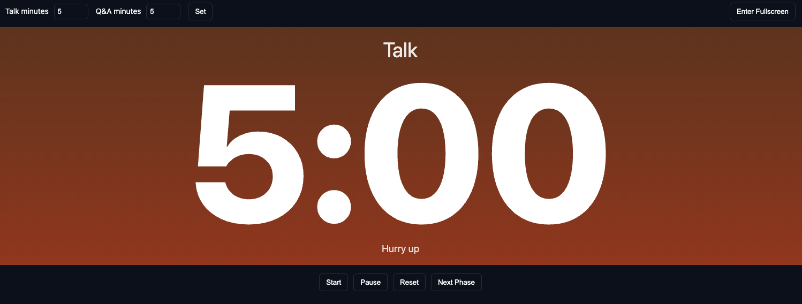
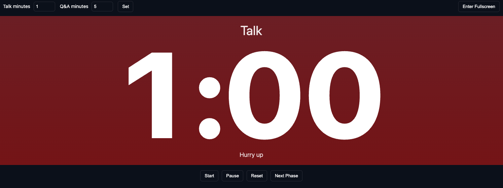

# StageTimer — Local

Simple local stage timer you can run on your machine. No build steps required.

Usage

- Open [index.html](index.html) directly in a browser (Chrome/Safari/Edge).
- Or run a local file server and open http://localhost:8000:

```bash
python3 -m http.server 8000
# then open http://localhost:8000 in your browser
```

iPad / iOS notes

- Open `index.html` in Safari on your iPad (or host and open from `http://localhost`).
- To install as a fullscreen app: in Safari tap Share → "Add to Home Screen". The app will open standalone.
- For best readability, rotate the iPad to landscape and tap `Enter Fullscreen`.

Accessing from an iPad when Safari won't open local files

- Safari on iPad won't always appear as an "Open in" target for local `index.html` files. The reliable method is to serve the folder over HTTP from your Mac and open it in Safari on the iPad.
- From your project folder run this helper script (I added `serve.sh`):

```bash
# make executable once
chmod +x serve.sh
# run the server
./serve.sh
```

The script prints a URL like `http://192.168.1.42:8000` — open that URL in Safari on your iPad (both devices must be on the same Wi‑Fi network).

Notes & troubleshooting

- If the iPad can't reach the Mac, check macOS Firewall in `System Settings → Network → Firewall` and allow incoming connections or temporarily disable the firewall for testing.
- If you can't put both devices on the same network, use an external tunnel like `ngrok` or `localtunnel` (I can add instructions if you want).

Controls

- Set talk and Q&A minutes, then press `Set`.
- The timer automatically switches from Talk to Q&A when Talk reaches 0.
- The background turns orange at 5 minutes and red at 1 minute.
- `Start`, `Pause`, `Reset`, `Next Phase` buttons control the countdown.
- Keyboard: `Space` to start/pause, `N` to go to next phase, `R` to reset.
- Click `Enter Fullscreen` for a full-screen large display.

Files

- [index.html](index.html)
- [app.js](app.js)
- [styles.css](styles.css)

Notes

- Designed to run locally on your device; no external dependencies.




